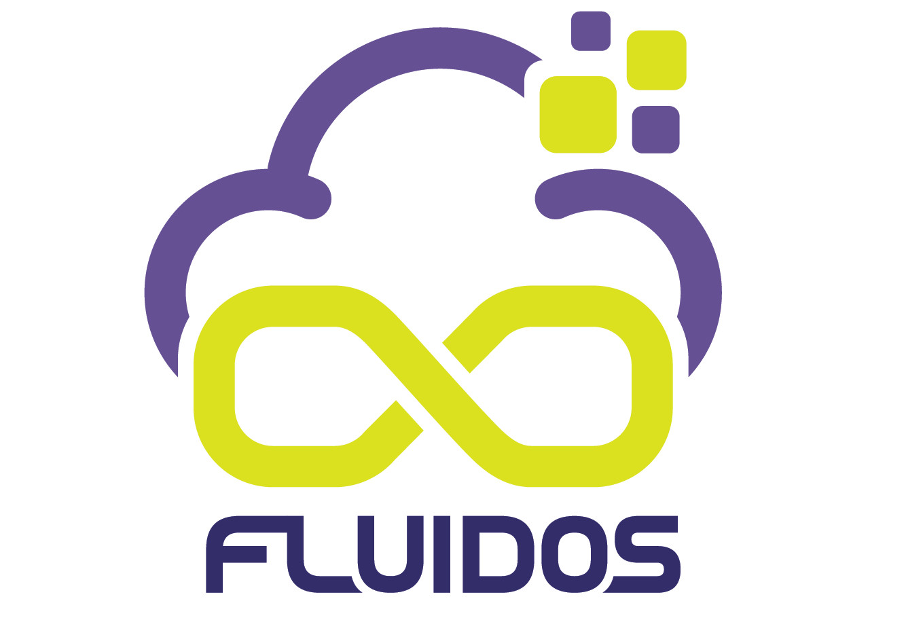

## FLUIDOS Project

**FLUIDOS** (**F**lexible, sca**L**able, sec**U**re, and decentral**I**se**D** **O**perating **S**ystem) aims to leverage the enormous, unused processing capacity at the edge, scattered across heterogeneous edge devices that struggle to integrate with each other and to coherently form a seamless computing continuum.

# FLUIDOS vision and objectives

The IT landscape has evolved into a world of hyperconnectivity, where devices and information systems communicate and exchange data on numerous applications. FLUIDOS will leverage the enormous, unused processing capacity at the edge, scattered across heterogeneous edge devices that struggle to integrate with each other and to form a seamless computing continuum coherently.

## FLUIDOS has the objectives:
1. **Fluidify the edge and unify it with the cloud** through a borderless, decentralised continuum leveraging automatic, autonomous resource discovery and integration.
2. **Move the gravity outside the data centre**, creating a cross-provider, community-based computing and service fabric leveraging open-source software.
3. Orchestrate services and **hyper-distributed applications in a continuous, automated fashion** over multiple devices and domains, leveraging energy-efficient AI learning algorithms and training for mobility/behaviour prediction and traffic forecasting.
4. Introduce a **Zero Trust paradigm** aimed at securing the access of geographically scattered resources in an authenticated, authorised manner.
5. Enable the **emergence of a multi-stakeholder market of edge services and apps**, independent from cloud providers and crucial to ensuring European digital autonomy.

